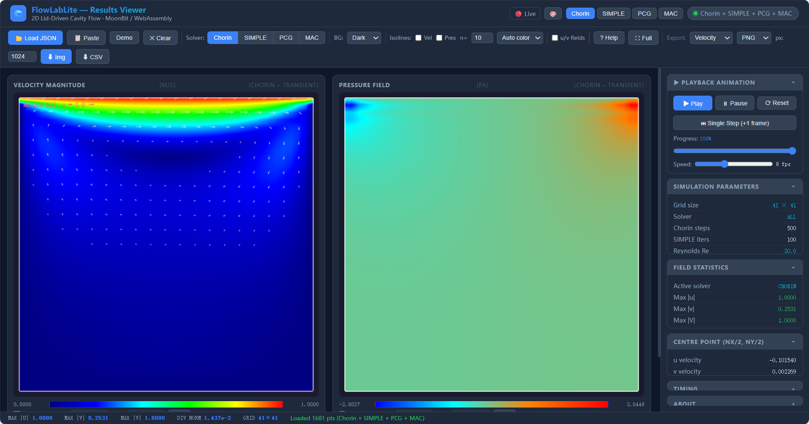

# FlowLabLite

FlowLabLite is a lightweight, AI-native CFD solver for 2D lid-driven cavity flow,
written in [MoonBit](https://www.moonbitlang.com/).
It compiles to WebAssembly (wasm-gc) and ships an interactive browser-based
visualization page (`cmd/main/main.html`) — including velocity heatmaps, pressure
heatmaps, and **streamline** overlay — with no runtime dependencies.

> **Online Demo**: serve the repo over HTTP and open `cmd/main/main.html` in Chrome 115+.  
> See [INSTALL.md](INSTALL.md) for one-command local serving instructions.

You can also view local data by opening `cmd/main/local_viewer.html` in a browser.

 

Four independent solvers are provided:

| Solver | Algorithm | Grid | Use case |
|---|---|---|---|
| **Chorin** | Projection method, explicit time-marching | 41×41 nodes | Transient simulation, 500 time steps |
| **SIMPLE** | Pressure-correction iteration, under-relaxation | 41×41 nodes | Steady-state iterative solve |
| **Chorin-PCG** | Projection method + PCG pressure solve | 41×41 nodes (collocated) | Transient, faster pressure convergence |
| **MAC** | Harlow-Welch staggered grid, PCG pressure | 40×40 cells | Transient, divergence-free by construction |

---


## Code Structure

```
FlowLabLite/
├── cmd/main/
│   ├── main.mbt              # All solver code (Chorin + SIMPLE + PCG + MAC) + WASM API
│   ├── main_bench.mbt        # Micro-benchmark (fib baseline)
│   ├── main_wbtest.mbt       # White-box tests T1–T58 (original suite)
│   ├── main_ext_wbtest.mbt   # White-box tests T59–T91 (extended + I/O)
│   ├── main.html             # Browser visualization (heatmaps + streamline overlay)
│   ├── local_viewer.html     # Browser viewer for locally computed JSON (4-solver tabs)
│   ├── moon.pkg.json         # Package config: imports, link/exports (62 functions)
│   └── ...                   # Other solver and I/O modules
├── cmd/main3d/               # 3D solver (main3d.mbt, main3d.html, etc.)
├── lib/
│   └── moon.pkg.json         # Library package placeholder
├── docs/                     # Documentation (see below for details)
├── examples/                 # Example CLI and AI workflow
├── build_wasm.sh             # 2D WASM build script (full export)
├── build_wasm_3d.sh          # 3D WASM build script
├── run_local.sh              # Run solver locally + extract JSON results
├── server.js                 # Node.js static server (npm alternative to python)
├── LICENSE                   # Apache-2.0
└── ...
```

---


## Test Suite

**165 tests, all passing** (`moon test --target wasm`)

- `cmd/main/main_wbtest.mbt` — T1–T58 (core/physics/preconditioner)
- `cmd/main/main_ext_wbtest.mbt` — T59–T152 (unit/integration/system/regression/I/O/3D/extended)
- `cmd/main3d/main3d_wbtest.mbt` — 3D solver tests

詳細については [docs/test_report_20260417.md](docs/test_report_20260417.md) 及び [docs/test_report_io_20260418.md](docs/test_report_io_20260418.md) を参照

---

## Runtime & Build Environment

| Tool/Env         | Minimum Version | Install/Usage |
|------------------|-----------------|--------------|
| moon (MoonBit)   | 0.1.20260309    | [官网](https://www.moonbitlang.com/download/) |
| moonc (compiler) | 0.8.3           | bundled      |
| node             | 18+             | [Node.js官网](https://nodejs.org/) (for npm server) |
| python           | 3.x             | (for python http.server) |
| Chrome/Edge/Brave| 115+            | 浏览器支持 wasm-gc stringref |
| Any HTTP server  |                 | 推荐 python 或 node (server.js) |

### 启动本地服务

1. **Python**:
	```bash
	python -m http.server 8080
	# 打开 http://localhost:8080/cmd/main/main.html
	```
2. **Node.js (npm server)**:
	```bash
	npm install
	node server.js 8080
	# 或直接 node server.js
	# 打开 http://localhost:8080/cmd/main/main.html
	```

---

## docs/ 目录文件简介

| 文件 | 简要说明 |
|---|---|
| [arch.md](docs/arch.md) | 系统架构分层、模块、数据流 |
| [api_reference.md](docs/api_reference.md) | 所有WASM导出函数签名说明 |
| [dev_guide.md](docs/dev_guide.md) | 开发环境、AI辅助开发流程 |
| [ghia_validation.md](docs/ghia_validation.md) | Ghia(1982)数值基准验证 |
| [test_report_20260417.md](docs/test_report_20260417.md) | 83测试用例详细报告 |
| [test_report_io_20260418.md](docs/test_report_io_20260418.md) | I/O模块8个新增测试报告 |
| [preconditioner_theory.md](docs/preconditioner_theory.md) | 预条件器理论推导 |
| [preconditioner_plan.md](docs/preconditioner_plan.md) | 预条件器实现计划 |
| [flow.md](docs/flow.md) | 执行流程图（Mermaid）|
| [validation_report.md](docs/validation_report.md) | 版本间一致性验证 |
| [design_pcg_solver.md](docs/design_pcg_solver.md) | PCG求解器设计说明 |
| [cfd_terminology.md](docs/cfd_terminology.md) | CFD术语表 |
| [SKILL.md](docs/SKILL.md) | 常见bug与架构决策 |
| [solver_monitor.md](docs/solver_monitor.md) | 监控量定义与说明 |
| [theory.md](docs/theory.md) | 理论推导与背景 |

---

### Key source file: `cmd/main/main.mbt`

**Chorin solver**

| Section | Description |
|---|---|
| `init_simulation()` | Zeroes Chorin state (`g_u`, `g_v`, `g_p`), resets step counter |
| `run_n_steps(n)` | Advances Chorin by *n* time steps |
| `cavity_flow_array()` | Core Navier-Stokes loop (explicit projection, finite-difference) |
| `pressure_poisson_array()` | Gauss-Seidel pressure solve (`nit` iterations) |
| `get_u/v/p_at(i,j)` | Point access to Chorin fields |
| `get_divergence_norm()` | Mean \|div u\| over interior cells |

**SIMPLE solver**

| Section | Description |
|---|---|
| `init_simple()` | Zeroes SIMPLE state (`g_u_s`, `g_v_s`, `g_p_s`) |
| `run_simple_n_iter(n)` | Runs *n* SIMPLE iterations with under-relaxation |
| `simple_one_iter()` | One SIMPLE sweep: predictor → pressure correction → update |
| `get_u/v/p_simple_at(i,j)` | Point access to SIMPLE fields |

**Chorin-PCG solver**

| Section | Description |
|---|---|
| `init_chorin_pcg()` | Zeroes PCG state (`g_u_pcg`, `g_v_pcg`, `g_p_pcg`) |
| `run_chorin_pcg_n_steps(n)` | Advances PCG solver by *n* time steps |
| `pressure_poisson_pcg()` | PCG pressure solve with Jacobi preconditioner |
| `laplacian_apply()` | Matrix-free 5-point Laplacian (collocated grid) |
| `get_u/v/p_pcg_at(i,j)` | Point access to PCG fields |

**MAC staggered-grid solver**

| Section | Description |
|---|---|
| `init_mac()` | Zeroes MAC state (`g_u_mac`, `g_v_mac`, `g_p_mac`) |
| `run_mac_n_steps(n)` | Advances MAC solver by *n* time steps |
| `cavity_flow_mac()` | MAC main loop: predictor → divergence → PCG → correction |
| `mac_u_predictor()` / `mac_v_predictor()` | Advection-diffusion step with ghost-cell BCs |
| `pressure_poisson_pcg_mac()` | PCG pressure solve on `mac_nc × mac_nc` grid |
| `mac_correct_velocity()` | Velocity correction: u -= dt/ρ/dx · ∂p/∂x |
| `apply_pressure_bcs_mac()` | Dirichlet p=0 at top lid; Neumann on other walls |
| `get_u/v/p_mac_at(i,j)` | Point access to MAC fields |
| `get_mac_divergence_norm()` | Mean \|div u\| over PCG-interior cells (i,j = 1..nc-2) |

---

## Prerequisites

| Tool | Minimum version | Install |
|---|---|---|
| `moon` (MoonBit build tool) | 0.1.20260309 | https://www.moonbitlang.com/download/ |
| `moonc` (MoonBit compiler) | 0.8.3 | bundled with moon |
| `node` (for export verification only) | 18+ | https://nodejs.org/ |
| Chrome / Edge / Brave | 115+ | required to run wasm-gc with stringref |
| Any HTTP server | — | see "Serving the page" below |

---

## Quick Start — From Source to Browser

### 1. Install dependencies

```bash
moon version
moonc -v
node --version   # 18+ required
```

### 2. Clone and enter the project

```bash
git clone https://github.com/YuFenfen-ai/FlowLabLite.git
cd FlowLabLite
```

### 3. Run the tests

```bash
moon test --target wasm    # runs all 165 tests (T1–T58 + T59–T152 + 3D)
```

Expected output:
```
Total tests: 165, passed: 165, failed: 0.
```

### 4. Build the WASM binary

```bash
bash build_wasm.sh release    # optimised build
bash build_wasm.sh            # debug build
```

The script prints the export list (62 functions + `_start` + `memory` = 64 symbols).

### 5. Serve over HTTP

```bash
python -m http.server 8080
```

### 6. Open in Chrome 115+

```
http://localhost:8080/cmd/main/main.html
```

---

## How to Build

### Step 1 – Compile

```bash
moon build --target wasm-gc          # debug build
moon build --target wasm-gc --release  # release build
```

> **Known issue in moon 0.1.20260309:** `moon build` alone does not export
> the API functions. Use `build_wasm.sh` to re-link with full exports.

### Step 2 – Re-link with exported functions (required)

```bash
bash build_wasm.sh          # debug WASM
bash build_wasm.sh release  # release WASM
```

### Step 3 – Run the tests

```bash
moon test --target wasm
```

---

## How to Use – Local Run + Browser Viewer

### Step 1 – Configure the run (optional)

Edit the constants at the top of `cmd/main/main.mbt`:

| Constant | Default | Description |
|---|---|---|
| `timing_enabled` | `true` | Master timing switch |
| `run_chorin` | `true` | Run Chorin solver |
| `local_nt` | `nt` (500) | Chorin time steps |
| `run_simple` | `true` | Run SIMPLE solver |
| `local_simple_n` | `100` | SIMPLE iterations |
| `run_pcg` | `true` | Run Chorin-PCG solver |
| `local_pcg_nt` | `nt` (500) | PCG time steps |
| `run_mac` | `true` | Run MAC solver |
| `local_mac_nt` | `nt` (500) | MAC time steps |

### Step 2 – Run the simulation locally

```bash
bash run_local.sh                  # → results.json (all four solvers)
bash run_local.sh my_results.json  # → custom filename
```

### Step 3 – Open the local viewer

Open `cmd/main/local_viewer.html` in a browser.

### Step 4 – Load results

Drag & drop `data/sample_results.json` onto the page. Solver tabs **Chorin / SIMPLE / PCG / MAC**
appear when the JSON contains multiple solvers. Clicking a tab switches all plots
and statistics to that solver. For MAC, the grid size shown is 40×40 (cell centres).

---

## Solver Algorithms

### Chorin Projection Method (1968)

Explicit fractional-step time-marching:
1. Solve momentum equations explicitly for intermediate velocity u*
2. Solve pressure Poisson equation: ∇²p = ρ/dt · div(u*)  (Gauss-Seidel, `nit` iterations)
3. Correct velocity: u = u* − (dt/ρ) · ∇p
4. Apply boundary conditions

### SIMPLE (Patankar & Spalding 1972)

Steady-state pressure-correction iteration with under-relaxation:
1. Momentum predictor (explicit, under-relaxation α_u = 0.7)
2. Build pressure-correction source: b = −∇·u*
3. Solve ∇²p' = b (Gauss-Seidel, 50 inner iterations)
4. Update: p ← p* + α_p · p'  (α_p = 0.3); u/v corrected

### Chorin-PCG

Same fractional-step structure as Chorin but the pressure Poisson solve uses
**Preconditioned Conjugate Gradient** (PCG) with Jacobi preconditioner instead
of Gauss-Seidel:
- Matrix-free 5-point Laplacian (`laplacian_apply`)
- Jacobi preconditioner: M⁻¹r = r / (2/dx² + 2/dy²)
- Tolerance: 1×10⁻⁶, max iterations: 200
- Boundary conditions: Dirichlet p=0 at top, Neumann elsewhere

### MAC Staggered Grid (Harlow & Welch 1965)

Staggered arrangement with PCG pressure solve:
- **p** at cell centres — mac_nc × mac_nc (40×40)
- **u** at x-face centres — mac_nc × (mac_nc+1)
- **v** at y-face centres — (mac_nc+1) × mac_nc
- Ghost-cell BCs: top lid u = 2·U_lid − u[ny-1][j] (linear interpolation), no-slip on other walls
- Divergence-free guarantee: PCG-interior cells (i,j = 1..38) have exact ∇·u = 0 by construction

---

## WASM Exports (62 functions)

**Chorin solver (27):**
`init_simulation`, `run_all_steps`, `run_n_steps`,
`get_nx`, `get_ny`, `get_nt`, `get_nit`, `get_re`, `get_dx`, `get_dy`, `get_dt`, `get_rho`, `get_nu`,
`get_step_count`, `get_u_at`, `get_v_at`, `get_p_at`,
`get_velocity_magnitude_at`, `get_max_velocity_magnitude`,
`get_u_center`, `get_v_center`, `get_p_center`,
`get_divergence_norm`, `get_max_u`, `get_max_v`, `get_max_p`, `get_min_p`

**SIMPLE solver (11):**
`init_simple`, `run_simple_n_iter`,
`get_simple_step_count`, `get_simple_residual`,
`get_u_simple_at`, `get_v_simple_at`, `get_p_simple_at`,
`get_max_u_simple`, `get_simple_divergence_norm`

**Chorin-PCG collocated solver (13):**
`init_chorin_pcg`, `run_chorin_pcg_n_steps`,
`get_pcg_step_count`, `get_pcg_last_iters`,
`get_u_pcg_at`, `get_v_pcg_at`, `get_p_pcg_at`,
`get_velocity_magnitude_pcg_at`, `get_max_u_pcg`, `get_max_v_pcg`,
`get_max_p_pcg`, `get_min_p_pcg`, `get_pcg_divergence_norm`

**MAC staggered solver (14):**
`init_mac`, `run_mac_n_steps`,
`get_mac_step_count`, `get_mac_last_iters`, `get_mac_nc`,
`get_u_mac_at`, `get_v_mac_at`, `get_p_mac_at`,
`get_velocity_magnitude_mac_at`,
`get_max_u_mac`, `get_max_v_mac`, `get_max_p_mac`, `get_min_p_mac`,
`get_mac_divergence_norm`

---

## Test Report

### Running tests

```bash
moon test --target wasm      # 165 tests on wasm target
```

### Test summary (165 tests, all passing)

Test files are discovered automatically:
- `cmd/main/main_wbtest.mbt` — T1–T58 (original functional tests)
- `cmd/main/main_ext_wbtest.mbt` — T59–T152 (extended suite: unit/integration/system/regression/I/O/advanced)
- `cmd/main3d/main3d_wbtest.mbt` — 3D solver validation

#### Chorin solver (T1–T16)

| # | Test name | Validates |
|---|---|---|
| 1 | `create_zeros_2d` | Array utility: correct dimensions, all-zero init |
| 2 | `copy_2d_array` | Deep copy, source independence |
| 3 | `generate_mesh_grid` | Coordinate range [0,2]×[0,2], monotonicity |
| 4 | `init_simulation_resets_state` | Global arrays zeroed, step counter reset |
| 5 | `boundary_conditions_after_run` | Lid u=1, no-slip walls after 10 steps |
| 6 | `step_counter` | Counter increments across multiple run_n_steps calls |
| 7 | `out_of_range_returns_zero` | get_*_at returns 0 for out-of-bounds indices |
| 8 | `constant_accessors` | nx=41, ny=41, Re=20, rho=1, nu=0.1, dt=0.001 |
| 9 | `velocity_magnitude_consistency` | get_velocity_magnitude_at = sqrt(u²+v²) |
| 10 | `max_velocity_magnitude_bounds` | max_mag >= 0, max_mag >= max_u |
| 11 | `pressure_bounded` | Pressure finite within ±1000 after 50 steps |
| 12 | `center_getters_consistent` | get_u/v/p_center = get_*_at(ny/2, nx/2) |
| 13 | `divergence_norm_nonnegative` | Mean \|div u\| >= 0 |
| 14 | `build_up_b_nonzero` | Pressure source term non-trivial with lid velocity |
| 15 | `full_simulation_produces_vortex` | After 500 steps: negative u at centre, max_u >= 1 |
| 16 | `pressure_boundary_dp_zero` | dp/dy=0 at y=0, p=0 at y=2 |

#### SIMPLE solver (T17–T26)

| # | Test name | Validates |
|---|---|---|
| 17 | `simple_init_resets_state` | All SIMPLE fields zeroed, counter reset |
| 18 | `simple_step_counter` | Counter increments correctly across batches |
| 19 | `simple_boundary_conditions` | Lid u=1, no-slip walls, v=0 at top after 20 iters |
| 20 | `simple_out_of_range_returns_zero` | get_*_simple_at returns 0 for out-of-bounds |
| 21 | `simple_residual_nonnegative` | get_simple_residual() >= 0, divergence_norm >= 0 |
| 22 | `simple_produces_flow` | Non-zero interior u, v after 50 iterations |
| 23 | `simple_max_u_bounds` | 0 <= max_u_simple <= 2 (under-relaxation bounds field) |
| 24 | `simple_pressure_boundary` | p=0 at top; p[0,:]=p[1,:] (Neumann at bottom) |
| 25 | `simple_vs_chorin_qualitative` | Both solvers show negative u at centre after 200 iters |
| 26 | `simple_independent_of_chorin` | SIMPLE iterations do not modify Chorin global state |

#### Chorin-PCG solver (T27–T34)

| # | Test name | Validates |
|---|---|---|
| 27 | `pcg_init_resets_state` | PCG fields zeroed, step counter reset |
| 28 | `pcg_step_counter` | Counter increments with run_chorin_pcg_n_steps |
| 29 | `pcg_boundary_conditions` | Lid u=1, no-slip walls (side walls only, not lid row) |
| 30 | `pcg_out_of_range_returns_zero` | get_*_pcg_at returns 0 for out-of-bounds |
| 31 | `pcg_divergence_nonnegative` | get_pcg_divergence_norm() >= 0 |
| 32 | `pcg_divergence_near_zero` | After 50 steps, divergence norm < 1×10⁻⁴ |
| 33 | `pcg_produces_flow` | Non-zero interior velocity after 10 steps |
| 34 | `pcg_vortex_formation` | After 200 steps: negative u at centre (backflow vortex) |

#### MAC staggered solver (T35–T42)

| # | Test name | Validates |
|---|---|---|
| 35 | `mac_grid_size` | get_mac_nc() = mac_nc = nx-1 = 40 |
| 36 | `mac_pressure_bc` | Dirichlet p=0 at top row (i = mac_nc-1) |
| 37 | `mac_step_counter` | Counter increments with run_mac_n_steps |
| 38 | `mac_out_of_range_returns_zero` | get_*_mac_at returns 0 for out-of-bounds |
| 39 | `mac_boundary_u` | No-slip: u=0 at left/right walls; lid: u = U_lid at top ghost |
| 40 | `mac_boundary_v` | No-slip: v=0 at bottom wall and left/right walls |
| 41 | `mac_divergence_near_zero` | After 50 steps, divergence norm (interior cells) < 1×10⁻⁴ |
| 42 | `mac_vortex_formation` | After 200 steps: negative u at centre; divergence < 1×10⁻⁴ |

#### Preconditioner tests (T43–T58)

| Range | Group | Validates |
|---|---|---|
| T43–T48 | DILU preconditioner | Modified diagonal, BC preservation, < 1% error vs Jacobi PCG |
| T49–T54 | DIC preconditioner | IC(0) Cholesky, BC preservation, < 1% error vs Jacobi PCG |
| T55–T58 | GAMG preconditioner | 2-level V-cycle, BC preservation, < 1% error vs Jacobi PCG |

#### Extended suite (T59–T152) — `main_ext_wbtest.mbt`

| Range | Category | Validates |
|---|---|---|
| T59–T60 | Unit — array utilities | Deep-copy isolation, row independence |
| T61–T63 | Unit — Laplacian operator | x²/y² polynomial exactness, harmonic zero |
| T64–T65 | Unit — boundary conditions | Idempotency, coarse-grid apply |
| T66–T67 | Unit — RHS source term | Divergence-free oracle, formula verification |
| T68–T70 | Unit — GAMG sub-components | Prolongate constant field, restrict normalisation /4, smoother descent |
| T71–T74 | Integration — PCG residual | All 4 preconditioners satisfy ‖r‖/‖b‖ < 10·tol after solve |
| T75 | Integration — cross-preconditioner | Agreement < 1% on non-uniform polynomial RHS |
| T76–T79 | System — physics | SND sign convention, determinism, additive steps, SIMPLE mass conservation |
| T80–T83 | Regression — numerical | Modified-diag range, MAC divergence @200 steps, coarse Laplacian, vortex sign |

### Physical validation

**Chorin solver (Re = 20, 500 time steps):**
- Centre u-velocity ≈ −0.06 (backflow confirms clockwise primary vortex)
- Max u-velocity ≥ 1.0 (lid velocity maintained)
- Divergence norm decreases to O(10⁻²)

**SIMPLE solver (Re = 20):**
- Negative u at centre after 200 iterations confirms vortex
- Residual ‖div u‖ non-negative and decreasing
- Under-relaxation keeps max \|u\| bounded within [0, 2]

**Chorin-PCG solver (Re = 20):**
- PCG pressure convergence < 1×10⁻⁶ in typically 50–130 iterations per step
- Interior divergence norm < 1×10⁻⁴ after 50 steps
- Vortex structure (negative u at centre) confirmed after 200 steps

**MAC staggered solver (Re = 20):**
- PCG-interior cells (i,j = 1..38) guaranteed divergence-free by construction
- Divergence norm < 1×10⁻⁴ after 50 steps
- Vortex confirmed after 200 steps
- PCG iteration count decreases as flow reaches quasi-steady state (~120 → ~50 iters/step)

---

## Simulation Parameters

| Parameter | Value | Description |
|---|---|---|
| `nx`, `ny` | 41 × 41 | Grid nodes in x and y (Chorin / SIMPLE / PCG) |
| `mac_nc` | 40 | MAC cell count per direction (= nx − 1) |
| `nt` | 500 | Chorin / PCG / MAC time steps |
| `nit` | 50 | Pressure-Poisson inner iterations (Chorin / SIMPLE) |
| `dx`, `dy` | 0.05 | Grid spacing (domain = 2 × 2) |
| `dt` | 0.001 | Time step |
| `rho` | 1.0 | Fluid density |
| `nu` | 0.1 | Kinematic viscosity |
| Re | 20 | Reynolds number (u_lid × L / nu = 1 × 2 / 0.1) |
| `simple_alpha_p` | 0.3 | SIMPLE pressure under-relaxation factor |
| `simple_alpha_u` | 0.7 | SIMPLE velocity under-relaxation factor |
| `pcg_tol` | 1×10⁻⁶ | PCG convergence tolerance |
| `pcg_max_iter` | 200 | PCG maximum iterations per step |

---

## License

Apache-2.0 — see [LICENSE](LICENSE).

Developed by Fenfen Yu (余芬芬) in collaboration with
Beihang University (北京航空航天大学) and
Ezhou Hi-Modeling Technology Co., Ltd. (鄂州海慕科技有限公司).
